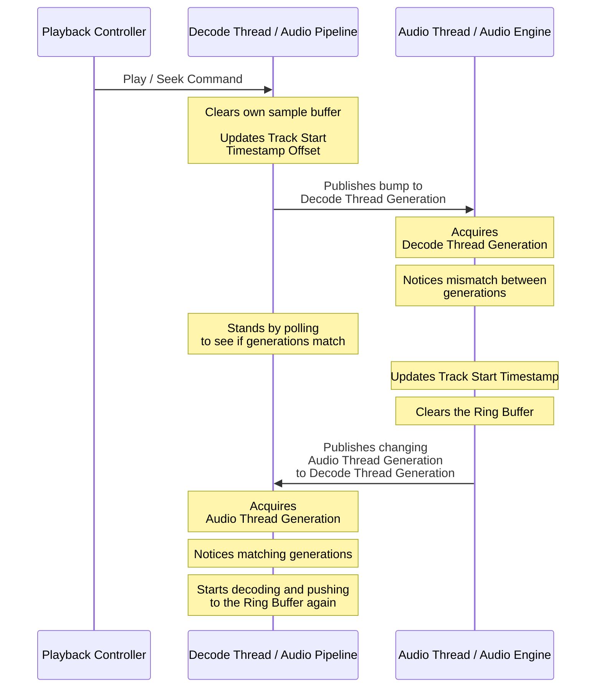

# Audio Concurrency

The app as a whole contains three major long lived threads that are necessary for the correct functioning of the audio system.

- **App thread:** Which handles everything related to the UI.
- **Decode thread:** Also named audio pipeline thread, which takes audio files and decodes and processes the audio samples that they hold, and feed it to the Audio thread.
- **Audio thread:** Refers to the thread that takes the processed samples from the decode thread and sends it to the OS.

The audio thread has a special constraint, it must never do things that block the thread, like allocating data or using mutexes that wait for locks to be released, otherwise we get unpredictable latency that will make the audio thread miss the critical deadline for giving the OS samples to play which will result in audible glitches. This means traditional methods of communication like normal mpsc channels are not allowed here, which constrains us to only be able to use wait-free methods for passing data in and out of the thread.

## Decode Thread Sample Consumption

For introducing samples into the audio thread we use a spsc ring buffer, the producer lives in the decode thread and the consumer lives in the audio thread, the audio thread continuously drains samples from the ring buffer while the decode thread produces them, since the production of samples is much faster than the consumption most of the time the ring buffer will be filled up completely, at that stage the decoder thread simply buffers the excess and waits some time to allow the audio thread to drain the samples before trying to feed them again. 

If the ring buffer completely drains, either because there are no more samples to play or the decode thread ran out of time to produce samples for the audio thread, the audio thread will output silence.

## Pausing the Audio Thread

To pause the audio thread, we have an atomic boolean within an atomic reference-counted shared pointer in the engine that holds the stream and the callback of the audio thread that when enabled it skips retrieving samples from the ring buffer. The reason why we don't pause the stream directly is that certain audio backends like ALSA in Linux do not support it.

## Generation Counting

To be able to properly track the samples that have been played from the current active track, we keep several atomic values shared across the app, the audio thread, and the decode thread:

- Samples played: Tracks how many output samples were played since the start of the program.
- Track Start Timestamp: Tracks in which samples played value we started playing samples from the track we are currently playing.
- Track Start Timestamp Offset: An added offset that allows us to determine how much samples of the currently played track have been skipped when it started playing.

But only using these values introduces a set of problems in which it is impossible to determine when the derived atomic values need to be recomputed and when to drain the ring buffer so we don't play stale samples, this means we can get visible UI problems like the progress bar jumping back for a second when you skip to the middle of a track, not to mention subtle bugs with the correctness of the values due to the indeterminism of thread execution. To address this need for being able to determine if there has been a change that needs to be acknowledged somewhere else we use generation counters.

The idea is simple, the audio thread depends on the decode thread letting it know that it needs to drain the buffer and recompute the Track Start Timestamp based on the Track Start Timestamp Offset and the current observed Samples played value within the audio thread, which is the only thread that can guarantee that the samples played value used is the correct one, so we basically use two atomic numbers, every time we seek or play a new track, we bump the number in the corresponding thread, and the other thread can basically observe that these numbers aren't matching to perform the necessary procedures.

While these handshake steps happen sequentially in this order, the truth is that there is a non-deterministic latency between them, the way each thread notices the state of the two generations is by constantly checking on each run if they are matching or mismatched and this depends on how the scheduler handles thread execution.

The way we ensure that the changes to the atomic values are guaranteed to be ordered correctly is by using `Release` and `Acquire` ordering, we `Release` at the end of changes to more than one atomic values, and we `Acquire` at the very beginning the same value we published with `Release` to ensure all the other atomics related to its change are updated as well.

The App also consumes these generations, when issuing a play track or seek command to the playback controller it saves first the current audio thread generation, and it won't report playback progress until the generation is higher than the generation that was saved. When doing several operations that require bumping the current playback generation, we need to take this into account when setting the threshold by increasing it by the number of intermediate generation count values, so we don't report progress on an intermediate state of the playback system.
